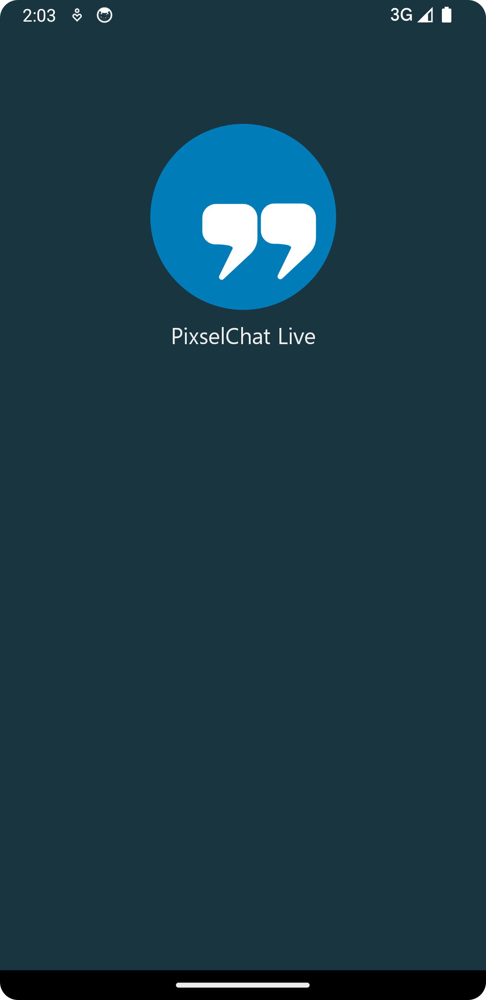
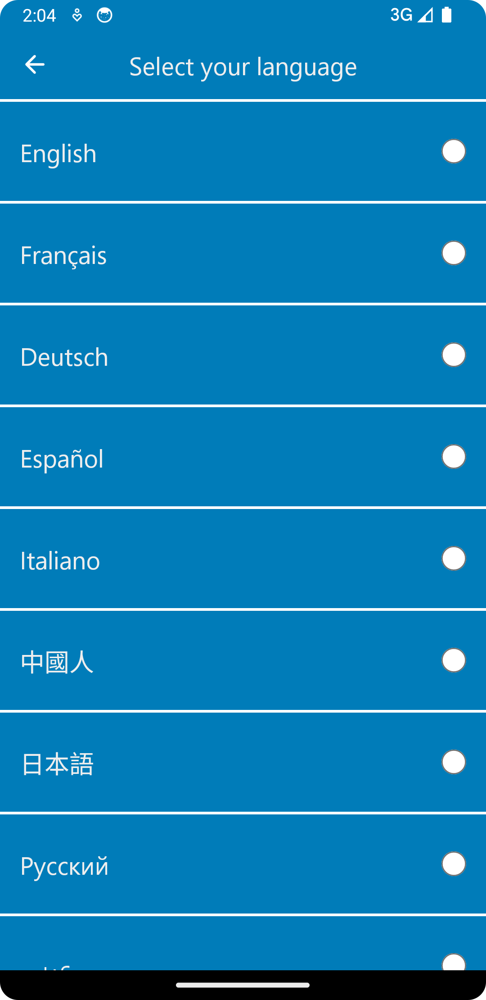
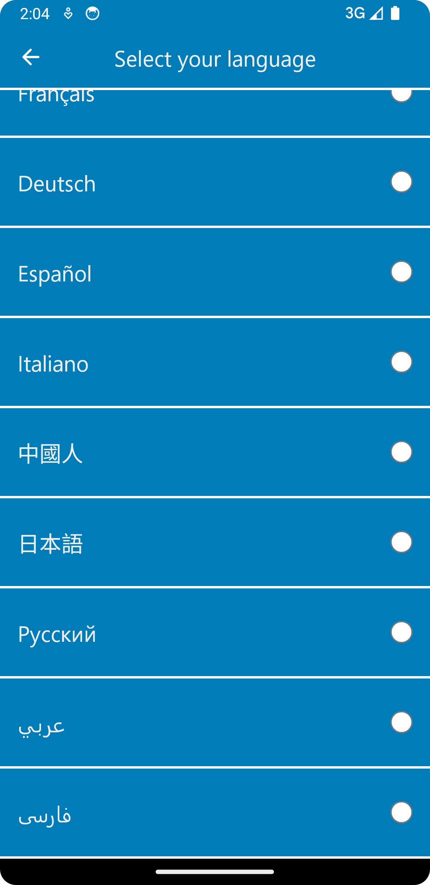
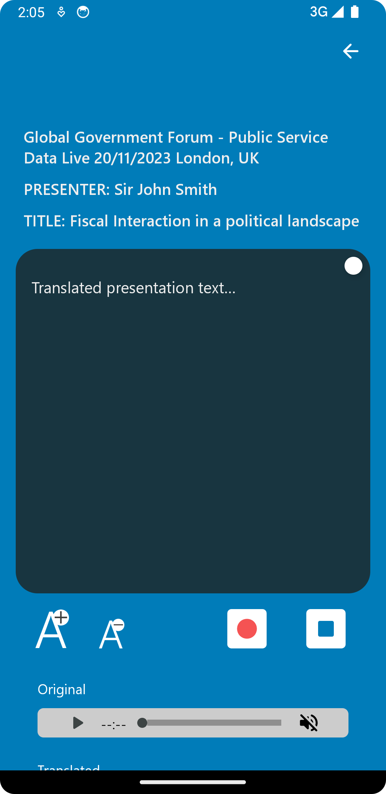
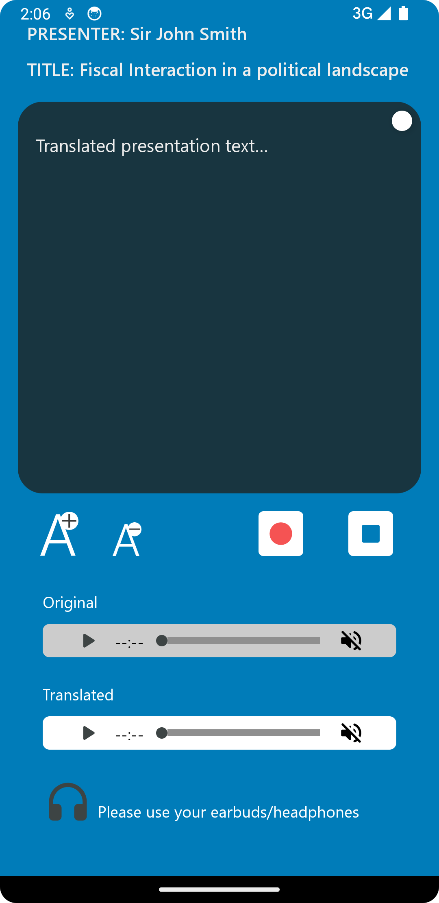

# PixselChat-Live (Android)
PixselChat Live (Android) UI Implementation

## Please find the following screens
- MainActivity.kt
- LanguageMenuFragment.kt
- TranslationFragment.kt

### MainActivity.kt
The initial page which displays the PixselChat Live logo and title



### LanguageFragment.kt
The PixselChat Live page which the end user can use to select their language of choice




The list of available languages can be edited programmatically, in Kotlin,
by either adding, removing or editing a value in the ```Language``` enum.

### TranslationFragment.kt
The PixselChat Live page for the live translation of the conference.




The meta data for end user can be edited programmatically, in Kotlin,
by setting the value of the fields of the ```Session``` object in ```LanguageRecyclerViewAdapter```,
For example,  ```Session(
                    ...
                    view.context.getString(R.string.<string_variable_name>),
                    ...
                ) ```
